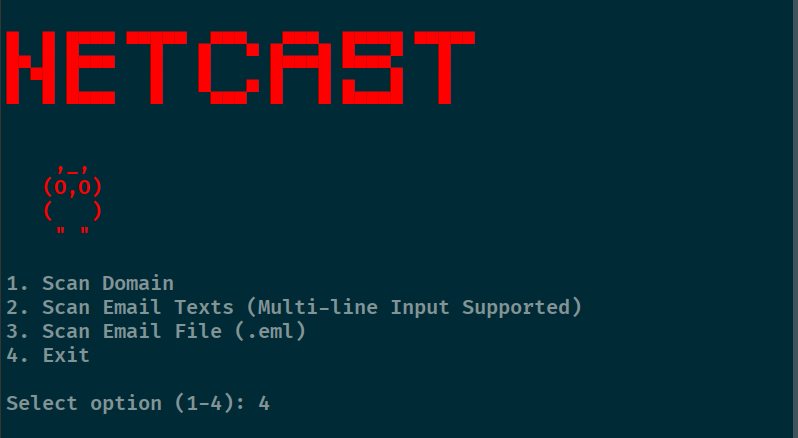
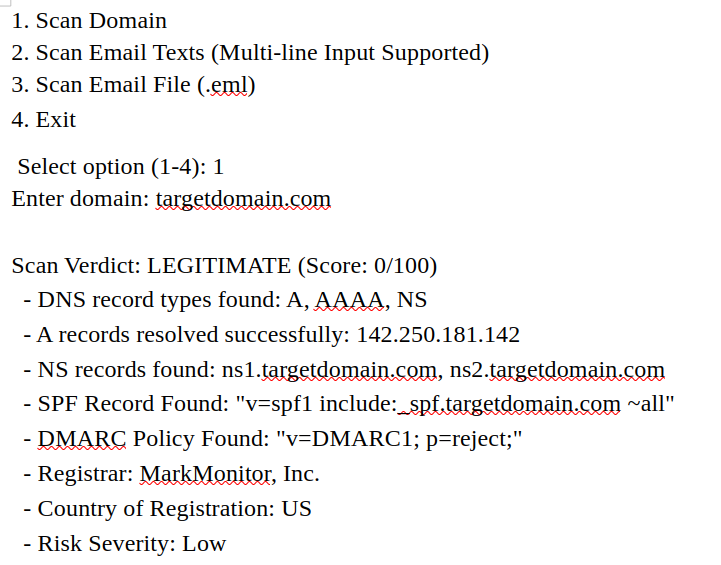
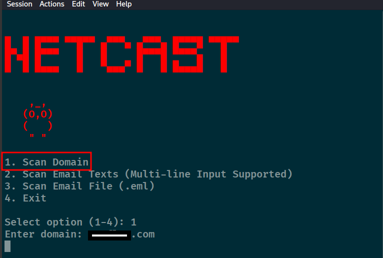
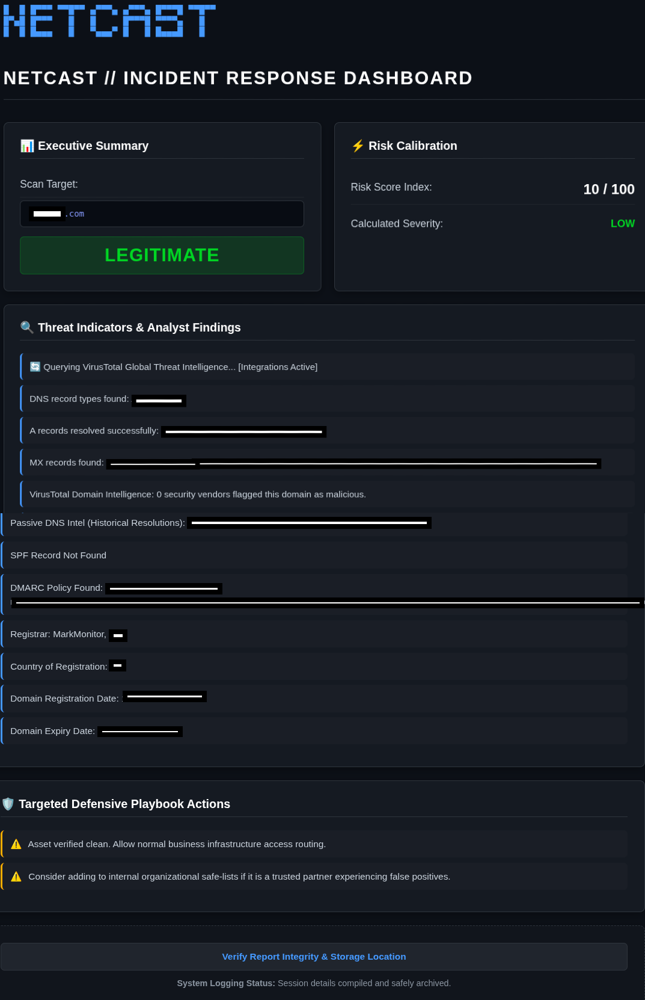
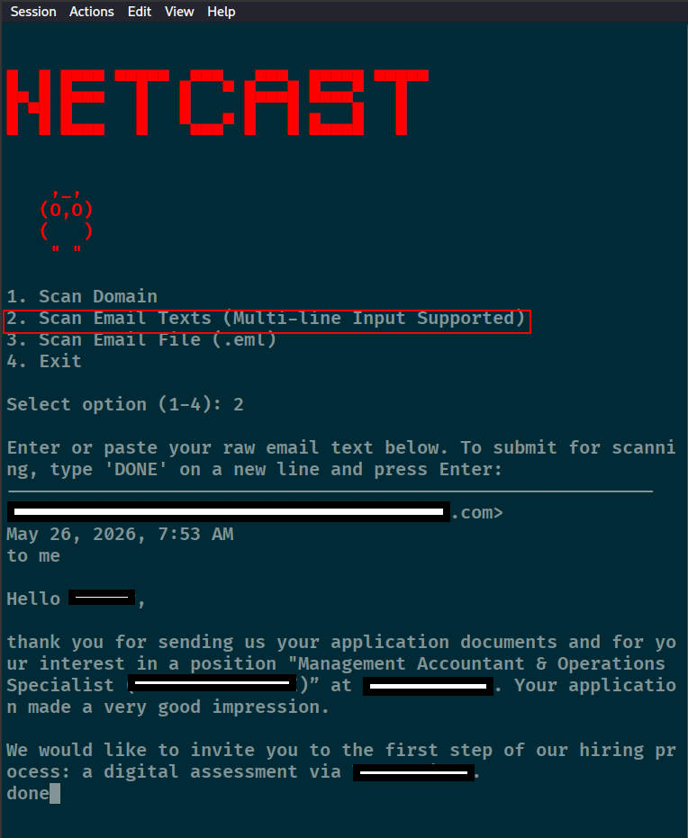
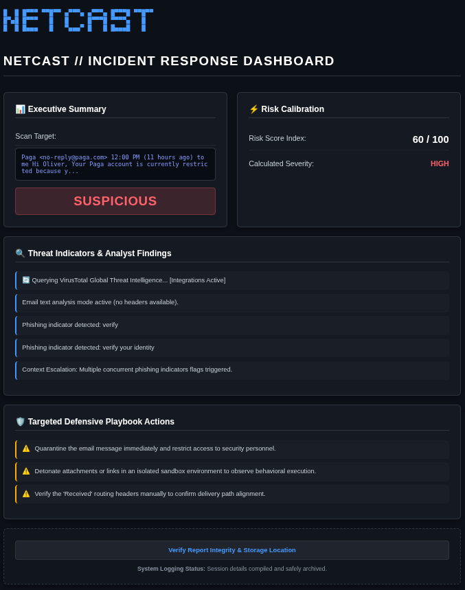
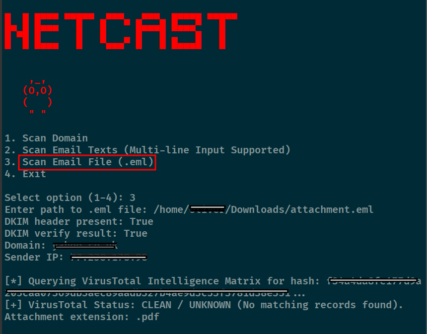
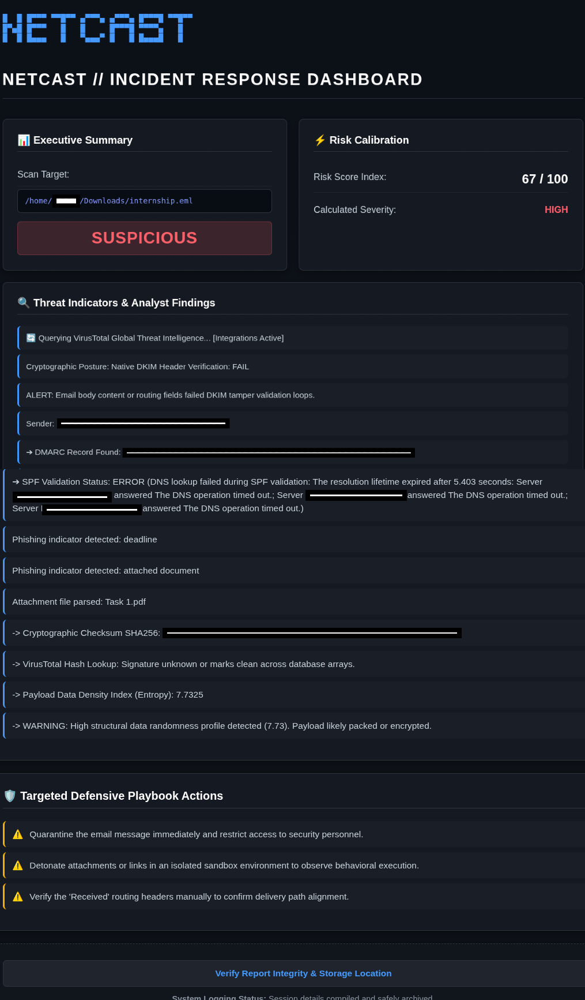
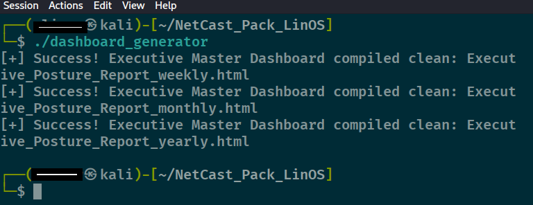
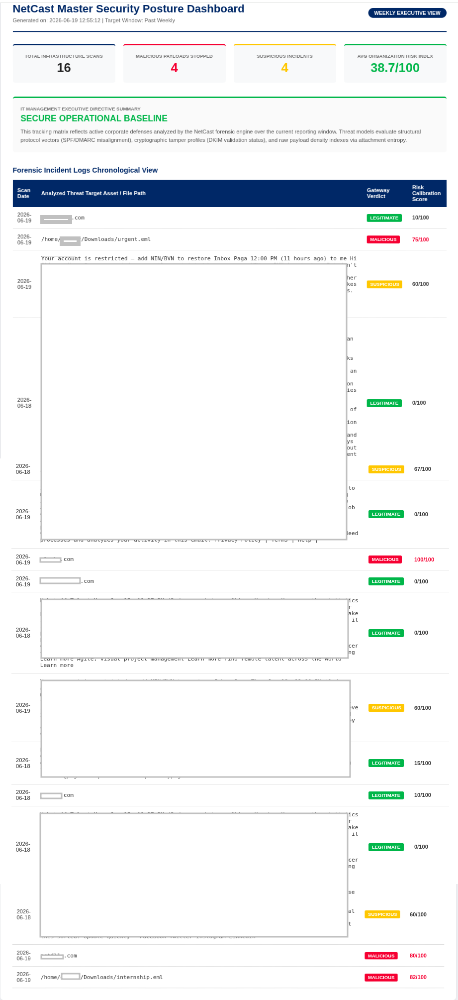

**NETCAST (OSS FREE VERSION)**

NetCast is a lightweight, high-performance command-line interface (CLI) mail forensics and domain threat auditing utility designed for security analysts and network administrators. It automates local infrastructure diagnostics, validates essential email authentication postures, and conducts passive WHOIS footprinting entirely from the terminal.

🚀 **Key Features**

    • Advanced DNS Auditing: Resolves and displays structural namespace mapping including A, AAAA, and NS records.
    • Email Security Posture Validation: Parses live text data or direct file inputs to analyze infrastructural alignment against SPF and DMARC   policies.
    • Passive Open-Source Intelligence (OSINT): Queries domain age vectors, registration lifecycles, and registrar origins via raw WHOIS data scraping.
    • Console-Native Risk Scoring: Computes instant threat visibility calculations dynamically formatted directly to the terminal screen.
    
📋** System Prerequisites**

NetCast is engineered to operate cross-platform across modern Linux distributions (tested on Kali Linux), and Windows environments running Python 3.12.3

🔧 **Installation & Configuration**

    1. Clone the Source Repository:
       git clone https://github.com/ougwoke/NetCast.git
       cd NetCast
       
       How to do it:
       * Open your terminal
       * Copy the NetCast URL link
       * Type git clone followed by that link and press Enter.

2. **Deploy Local Dependencies: **

Install the required foundational Python packages utilizing pip:

       * pip install -r requirements.txt (On Linux & Windows)
       * pip3 install -r requirements.txt (On macOS)  
       

💻 **Operational Usage**

Execute the primary forensic file directly from your terminal session:

       * python3 netcast_core (Linux & macOS)
       * python netcast_core.py (Windows - Note save with .py before executing)

       
3. **Sample Terminal Execution Output**
   

**==================== **PREMIUM VERSION** ===================**

Subscribe to your NetCast - Basic Edition | NetCast - Professional Edition | NetCast - Enterprise Core

at:  https://ugwoke2.gumroad.com/

🌟 WHAT MAKES PREMIUM ELITE:
===============================

1. GLOBAL THREAT INTELLIGENCE INTEGRATION: Features a dynamic, isolated API module mapping directly against global reputation aggregates (VirusTotal) for zero-day URL and malicious   infrastructure cross-referencing.

2. AUTOMATED JSON TELEMETRY ARCHIVING:  Every scan automatically commits structured JSON log payloads down to local disk space for enterprise compliance logging.

3. EXECUTIVE HTML POSTURE DASHBOARD GENERATOR:  Includes an independent compilation engine that crawls your log database to render production-ready, beautiful HTML dashboards reflecting your daily, weekly, monthly, and yearly enterprise risk trends.

📦 **WHAT IS INCLUDED IN YOUR COMMERCIAL PACK:**

    * netcast_tool (Fully Compiled, Self-Contained High-Performance Executable)
    * dashboard_generator (Plain-Text Adaptable HTML Reporting Engine Script)
    * .env (Global Context Token Environment Template)
    * SETUP_GUIDE.txt (Granular, Step-by-Step Security Deployment Manual)
    * Whitelist Management (Your trusted alert bypass text file)
    

Stop copy-pasting terminal readouts into Notepad. Deploy NetCast Premium, generate professional corporate dashboard reports, and maximize your client delivery standards today!

📊 PHYSICAL DEMONSTRATION & EXECUTIVE REPORTING
=================================================

1. MODULE PREVIEW: DOMAIN AUDIT (CLI & REPORT ALIGNMENT) 

Run the Tool (NetCast)

2. MODULE PREVIEW: EMAIL_TEXT AUDIT
   
→ Paste email texts
→ Type done on the next line
→ Hit Enter

3. MODULE PREVIEW: EMAIL_FILE AUDIT (DEEP CONTEXT FORENSICS)

4. COMPLIANCE ENGINE: MASTER POSTURE OVERVIEW PANEL
   
To generate your weekly/monthly/yearly reports:

   Run: 
   
       * python3 dashboard_generator (LInux & macOS) in your file directory and you see all your reports there.
       * python dashboard_generator.py (Windows)
 
   

Note:   Linux/Mac Users: python3 dashboard_generator

        Windows Users: python dashboard_generator.py

        

**========== MIT LICENSE & DISCLAIMER =============**

MIT LICENSE
============

Copyright (c) 2026 Ugwoke Oliver Igwenagum

Permission is hereby granted, free of charge, to any person obtaining a copy
of this software and associated documentation files (the "Software"), to deal
in the Software without restriction, including without limitation the rights
to use, copy, modify, merge, publish, distribute, sublicense, and/or sell
copies of the Software, and to permit persons to whom the Software is
furnished to do so, subject to the following conditions:

The above copyright notice and this permission notice shall be included in all
copies or substantial portions of the Software.

THE SOFTWARE IS PROVIDED "AS IS", WITHOUT WARRANTY OF ANY KIND, EXPRESS OR
IMPLIED, INCLUDING BUT NOT LIMITED TO THE WARRANTIES OF MERCHANTABILITY,
FITNESS FOR A PARTICULAR PURPOSE AND NON-INFRINGEMENT. IN NO EVENT SHALL THE AUTHORS OR COPYRIGHT HOLDERS BE LIABLE FOR ANY CLAIM, DAMAGES OR OTHER LIABILITY, WHETHER IN AN ACTION OF CONTRACT, TORT OR OTHERWISE, ARISING FROM, OUT OF OR IN CONNECTION WITH THE SOFTWARE OR THE USE OR OTHER DEALINGS IN THE SOFTWARE.

LEGAL DISCLAIMER & TERMS OF USE
================================
NetCast is developed strictly for educational, administrative, defensive security research, and authorized forensic auditing purposes. 

1. AUTHORIZATION REQUIRED: Users must ensure they have explicit, written authorization from the respective infrastructure owners before performing any audits or threat intelligence processing using this utility. Unsanctioned querying or infrastructure mapping against target networks may violate local and international cybercrime laws.

2. WARRANTY & LIABILITY: The developer assumes zero liability and is not responsible for any misuse, disruptions, data leaks, service degradation, or collateral damage caused by the application or execution of this software. 
